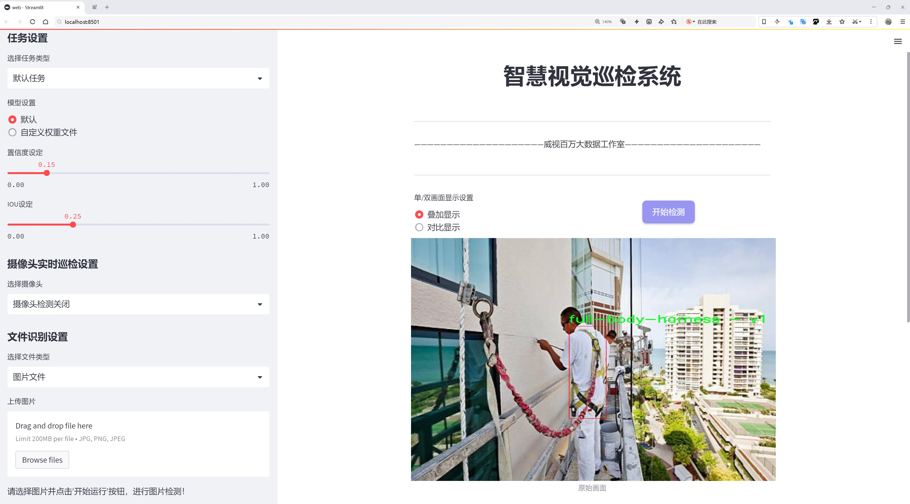

# 全身安全带检测检测系统源码分享
 # [一条龙教学YOLOV8标注好的数据集一键训练_70+全套改进创新点发刊_Web前端展示]

### 1.研究背景与意义

项目参考[AAAI Association for the Advancement of Artificial Intelligence](https://gitee.com/qunshansj/projects)

项目来源[AACV Association for the Advancement of Computer Vision](https://gitee.com/qunmasj/projects)

研究背景与意义

随着工业化进程的加快，安全生产问题日益凸显，尤其是在建筑、矿山和高空作业等领域，工人安全防护措施的有效性直接关系到生命安全和企业的可持续发展。全身安全带作为一种重要的个人防护装备，能够有效降低高空作业时的坠落风险。然而，安全带的佩戴情况往往难以实时监测，导致一些工人在工作时未能正确佩戴安全带，从而增加了事故发生的概率。因此，开发一种高效、准确的全身安全带检测系统，具有重要的现实意义和应用价值。

近年来，计算机视觉技术的快速发展为安全带检测提供了新的解决方案。YOLO（You Only Look Once）系列目标检测算法因其高效性和实时性，逐渐成为物体检测领域的主流方法。YOLOv8作为该系列的最新版本，结合了深度学习和计算机视觉的先进技术，具备了更强的特征提取能力和更快的检测速度。然而，针对特定场景的安全带检测，YOLOv8的原始模型可能在准确性和鲁棒性上存在一定的不足。因此，基于改进YOLOv8的全身安全带检测系统的研究显得尤为重要。

本研究的核心在于构建一个针对全身安全带的检测系统，利用现有的2200张图像数据集进行模型训练和优化。该数据集专注于全身安全带的检测，涵盖了多种不同的场景和工人姿态，能够为模型提供丰富的样本支持。通过对数据集的深入分析和处理，我们将探索如何有效提升YOLOv8在特定任务中的表现，尤其是在不同光照、角度和背景下的检测准确性。

此外，本研究还将探讨如何通过数据增强、迁移学习等技术手段，进一步提升模型的泛化能力，使其能够适应多变的实际应用环境。通过改进YOLOv8的算法结构和训练策略，我们期望能够实现更高的检测精度和更快的处理速度，从而为安全生产提供更为可靠的技术支持。

综上所述，基于改进YOLOv8的全身安全带检测系统的研究，不仅能够推动计算机视觉技术在安全生产领域的应用，还能为工人安全提供有效保障，降低事故发生率，促进企业的安全管理水平提升。这一研究不仅具有重要的学术价值，也将为实际生产提供切实可行的解决方案，具有广泛的社会意义和经济效益。通过本研究的实施，我们期待能够为安全生产领域的智能化、自动化发展贡献一份力量。

### 2.图片演示




##### 注意：由于此博客编辑较早，上面“2.图片演示”和“3.视频演示”展示的系统图片或者视频可能为老版本，新版本在老版本的基础上升级如下：（实际效果以升级的新版本为准）

  （1）适配了YOLOV8的“目标检测”模型和“实例分割”模型，通过加载相应的权重（.pt）文件即可自适应加载模型。

  （2）支持“图片识别”、“视频识别”、“摄像头实时识别”三种识别模式。

  （3）支持“图片识别”、“视频识别”、“摄像头实时识别”三种识别结果保存导出，解决手动导出（容易卡顿出现爆内存）存在的问题，识别完自动保存结果并导出到tempDir中。

  （4）支持Web前端系统中的标题、背景图等自定义修改，后面提供修改教程。

  另外本项目提供训练的数据集和训练教程,暂不提供权重文件（best.pt）,需要您按照教程进行训练后实现图片演示和Web前端界面演示的效果。

### 3.视频演示

[3.1 视频演示](https://www.bilibili.com/video/BV1PXtjeSEcF/)

### 4.数据集信息展示

##### 4.1 本项目数据集详细数据（类别数＆类别名）

nc: 1
names: ['full-body-harness - v1 2024-06-05 5-56pm']


##### 4.2 本项目数据集信息介绍

数据集信息展示

在现代安全管理和工地作业中，全身安全带的使用至关重要。为了提高安全带的检测效率和准确性，我们构建了一个专门的数据集，名为“jyfyfi”，旨在为改进YOLOv8的全身安全带检测系统提供高质量的训练数据。该数据集专注于单一类别的对象识别，确保模型能够在各种环境下准确识别和定位全身安全带。

“jyfyfi”数据集的类别数量为1，具体类别为“full-body-harness - v1 2024-06-05 5-56pm”。这一类别的命名不仅反映了数据集的核心主题，也标志着数据集的版本更新，显示出我们在数据收集和标注过程中的严谨态度。数据集中的样本涵盖了不同类型的全身安全带，包括多种颜色、款式和使用场景，确保模型能够在多样化的条件下进行有效的学习和推理。

在数据集的构建过程中，我们采用了高标准的图像采集和标注流程。每一张图像都经过精心挑选，确保其在光照、角度和背景等方面的多样性。这种多样性不仅增强了数据集的代表性，也为模型的泛化能力提供了保障。此外，所有图像均经过专业标注，确保全身安全带的边界框准确无误，便于YOLOv8模型进行训练。

为了进一步提升数据集的实用性，我们还考虑了不同的应用场景。例如，数据集中包含了工地、仓库和其他工业环境中的全身安全带图像，这些场景的变化将帮助模型在实际应用中更好地适应不同的工作环境。我们相信，这种针对性的数据集将极大地提高全身安全带的检测准确率，进而为工人提供更为可靠的安全保障。

在数据集的使用过程中，研究人员和开发者可以通过不同的训练策略来优化YOLOv8模型的性能。我们建议使用数据增强技术，例如随机裁剪、旋转和颜色变换等，以进一步丰富训练样本，提升模型的鲁棒性。此外，针对不同的训练参数和超参数设置，研究人员可以进行多次实验，以找到最佳的模型配置，从而实现更高的检测精度。

总之，“jyfyfi”数据集不仅是全身安全带检测研究的重要基础，也是推动安全生产和工人保护的重要工具。通过不断优化和更新数据集，我们希望能够为全身安全带的检测技术发展贡献力量，推动相关领域的进步与创新。未来，我们将继续致力于数据集的扩展和完善，以满足不断变化的行业需求和技术挑战。


### 5.全套项目环境部署视频教程（零基础手把手教学）

[5.1 环境部署教程链接（零基础手把手教学）](https://www.ixigua.com/7404473917358506534?logTag=c807d0cbc21c0ef59de5)


[5.2 安装Python虚拟环境创建和依赖库安装视频教程链接（零基础手把手教学）](https://www.ixigua.com/7404474678003106304?logTag=1f1041108cd1f708b01a)

### 6.手把手YOLOV8训练视频教程（零基础小白有手就能学会）

[6.1 手把手YOLOV8训练视频教程（零基础小白有手就能学会）](https://www.ixigua.com/7404477157818401292?logTag=d31a2dfd1983c9668658)

### 7.70+种全套YOLOV8创新点代码加载调参视频教程（一键加载写好的改进模型的配置文件）

[7.1 70+种全套YOLOV8创新点代码加载调参视频教程（一键加载写好的改进模型的配置文件）](https://www.ixigua.com/7404478314661806627?logTag=29066f8288e3f4eea3a4)

### 8.70+种全套YOLOV8创新点原理讲解（非科班也可以轻松写刊发刊，V10版本正在科研待更新）

由于篇幅限制，每个创新点的具体原理讲解就不一一展开，具体见下列网址中的创新点对应子项目的技术原理博客网址【Blog】：


[8.1 70+种全套YOLOV8创新点原理讲解链接](https://gitee.com/qunmasj/good)

### 9.系统功能展示（检测对象为举例，实际内容以本项目数据集为准）

图9.1.系统支持检测结果表格显示

  图9.2.系统支持置信度和IOU阈值手动调节

  图9.3.系统支持自定义加载权重文件best.pt(需要你通过步骤5中训练获得)

  图9.4.系统支持摄像头实时识别

  图9.5.系统支持图片识别

  图9.6.系统支持视频识别

  图9.7.系统支持识别结果文件自动保存

  图9.8.系统支持Excel导出检测结果数据


### 10.原始YOLOV8算法原理

原始YOLOv8算法原理

YOLOv8作为YOLO系列中的最新模型之一，继承并发展了YOLO系列的优良传统，采用了更为先进的anchor-free检测方法，显著提升了目标检测的精度和速度。YOLOv8的网络结构由输入端、主干网络、Neck端和输出端四个主要模块组成，设计上注重了特征提取的高效性和准确性，尤其是在复杂环境下的目标检测能力。

在输入端，YOLOv8采用了Mosaic数据增强、自适应图片缩放和灰度填充等多种预处理手段，以增强模型的鲁棒性和泛化能力。Mosaic数据增强的使用，虽然能够有效提升模型在多样化场景下的表现，但在训练的最后10个epoch中，YOLOv8选择停止使用该增强方式，以避免对数据真实分布的破坏，从而确保模型学习到的特征更为可靠。

主干网络部分，YOLOv8在设计上做出了重要的改进。它将传统的C3模块替换为C2f模块，后者引入了更多的跳层连接，旨在增强梯度流信息的丰富性，同时保持模型的轻量化特性。C2f模块的设计灵感来源于YOLOv7中的ELAN结构，能够更好地捕捉特征之间的关系，并在特征提取过程中保留更细粒度的上下文信息。此外，YOLOv8依然保留了SPPF（Spatial Pyramid Pooling Fast）结构，以提高特征提取的效率和效果。

在Neck端，YOLOv8基于PAN（Path Aggregation Network）结构进行设计，通过上采样、下采样和特征拼接的方式融合不同尺度的特征图。这种特征融合方法使得模型能够在不同的尺度上对目标进行有效的检测，尤其是在面对小目标时，能够更好地捕捉到目标的特征信息。

输出端采用了decoupled head结构，分别处理分类和回归任务。该结构的设计考虑到分类和定位任务的侧重点不同，分类任务更关注特征图中提取到的特征与已有类别的相似性，而定位任务则侧重于边界框与真实框之间的位置关系。通过将这两个任务解耦，YOLOv8在训练过程中能够更快地收敛，并提高预测的精度。

YOLOv8还引入了Task-Aligned Assigner（TAL）方法，对分类分数和回归分数进行加权，以优化正样本的匹配过程。这一方法通过引入分类分数和IOU的高次幂乘积作为衡量任务对齐程度的指标，进一步提升了模型在分类和定位任务中的表现。

在损失函数的设计上，YOLOv8采用了BCE（Binary Cross-Entropy）作为分类损失，DFL（Distribution Focal Loss）和CIoU（Complete Intersection over Union）损失函数作为回归损失。这种组合的损失函数设计旨在提高模型的泛化能力和精准度，使得YOLOv8在各种复杂场景下均能保持良好的检测性能。

尽管YOLOv8在多个方面进行了创新和改进，但在复杂水面环境下，仍然面临着小目标漂浮物特征复杂、背景多样等挑战，导致定位误差和对目标感知能力不足的问题。为了解决这些问题，研究者们提出了YOLOv8-WSSOD算法，进一步优化YOLOv8的性能。该算法通过引入BiFormer双层路由注意力机制构建C2fBF模块，以减轻主干网络下采样过程中的噪声影响，并保留更细粒度的上下文信息。此外，针对小目标漏检问题，YOLOv8-WSSOD还添加了一个更小的检测头，以提升网络对小目标的感知能力，并在Neck端引入GSConv和Slim-neck技术，以保持精度并降低计算量。最后，使用MPDIoU损失函数替换CIoU损失函数，进一步提高了模型的泛化能力和精准度。

综上所述，YOLOv8作为YOLO系列的最新进展，凭借其高效的网络结构和创新的算法设计，在目标检测领域展现出了强大的能力。尽管在特定环境下仍存在一些挑战，但其在多种应用场景中的表现，尤其是在实时性和准确性兼顾的任务中，依然具有广泛的研究和应用价值。随着对YOLOv8及其改进算法的深入研究，未来在复杂环境下的目标检测能力有望得到进一步提升。


### 11.项目核心源码讲解（再也不用担心看不懂代码逻辑）

#### 11.1 70+种YOLOv8算法改进源码大全和调试加载训练教程（非必要）\ultralytics\models\sam\build.py

以下是对代码的核心部分进行提炼和详细注释的结果：

```python
# 导入必要的库
from functools import partial
import torch

# 导入相关模块
from ultralytics.utils.downloads import attempt_download_asset
from .modules.decoders import MaskDecoder
from .modules.encoders import ImageEncoderViT, PromptEncoder
from .modules.sam import Sam
from .modules.tiny_encoder import TinyViT
from .modules.transformer import TwoWayTransformer

def _build_sam(encoder_embed_dim,
               encoder_depth,
               encoder_num_heads,
               encoder_global_attn_indexes,
               checkpoint=None,
               mobile_sam=False):
    """构建指定的SAM模型架构。

    参数:
    encoder_embed_dim: 编码器的嵌入维度
    encoder_depth: 编码器的深度
    encoder_num_heads: 编码器的头数
    encoder_global_attn_indexes: 全局注意力索引
    checkpoint: 可选的模型检查点路径
    mobile_sam: 是否构建移动版本的SAM模型
    """
    prompt_embed_dim = 256  # 提示嵌入维度
    image_size = 1024  # 输入图像大小
    vit_patch_size = 16  # ViT的补丁大小
    image_embedding_size = image_size // vit_patch_size  # 图像嵌入大小

    # 根据是否为移动版本选择不同的图像编码器
    image_encoder = (TinyViT(
        img_size=1024,
        in_chans=3,
        num_classes=1000,
        embed_dims=encoder_embed_dim,
        depths=encoder_depth,
        num_heads=encoder_num_heads,
        window_sizes=[7, 7, 14, 7],
        mlp_ratio=4.0,
        drop_rate=0.0,
        drop_path_rate=0.0,
        use_checkpoint=False,
        mbconv_expand_ratio=4.0,
        local_conv_size=3,
    ) if mobile_sam else ImageEncoderViT(
        depth=encoder_depth,
        embed_dim=encoder_embed_dim,
        img_size=image_size,
        mlp_ratio=4,
        norm_layer=partial(torch.nn.LayerNorm, eps=1e-6),
        num_heads=encoder_num_heads,
        patch_size=vit_patch_size,
        qkv_bias=True,
        use_rel_pos=True,
        global_attn_indexes=encoder_global_attn_indexes,
        window_size=14,
        out_chans=prompt_embed_dim,
    ))

    # 创建SAM模型
    sam = Sam(
        image_encoder=image_encoder,
        prompt_encoder=PromptEncoder(
            embed_dim=prompt_embed_dim,
            image_embedding_size=(image_embedding_size, image_embedding_size),
            input_image_size=(image_size, image_size),
            mask_in_chans=16,
        ),
        mask_decoder=MaskDecoder(
            num_multimask_outputs=3,
            transformer=TwoWayTransformer(
                depth=2,
                embedding_dim=prompt_embed_dim,
                mlp_dim=2048,
                num_heads=8,
            ),
            transformer_dim=prompt_embed_dim,
            iou_head_depth=3,
            iou_head_hidden_dim=256,
        ),
        pixel_mean=[123.675, 116.28, 103.53],  # 图像像素均值
        pixel_std=[58.395, 57.12, 57.375],  # 图像像素标准差
    )

    # 如果提供了检查点，则加载模型权重
    if checkpoint is not None:
        checkpoint = attempt_download_asset(checkpoint)  # 尝试下载检查点
        with open(checkpoint, 'rb') as f:
            state_dict = torch.load(f)  # 加载模型状态字典
        sam.load_state_dict(state_dict)  # 加载权重到模型中

    sam.eval()  # 设置模型为评估模式
    return sam  # 返回构建的SAM模型

def build_sam(ckpt='sam_b.pt'):
    """根据指定的检查点构建SAM模型。

    参数:
    ckpt: 检查点文件名
    """
    model_builder = None
    ckpt = str(ckpt)  # 将检查点转换为字符串，以支持Path类型
    for k in sam_model_map.keys():
        if ckpt.endswith(k):
            model_builder = sam_model_map.get(k)  # 获取对应的模型构建函数

    if not model_builder:
        raise FileNotFoundError(f'{ckpt} 不是支持的SAM模型。可用模型有: \n {sam_model_map.keys()}')

    return model_builder(ckpt)  # 调用模型构建函数并返回模型
```

### 代码分析
1. **模型构建函数**：`_build_sam`函数是构建SAM模型的核心，接收多个参数来配置模型的各个部分，包括编码器的维度、深度、头数等。
2. **图像编码器选择**：根据`mobile_sam`参数选择不同的图像编码器（`TinyViT`或`ImageEncoderViT`），这影响模型的结构和性能。
3. **模型组件**：SAM模型由图像编码器、提示编码器和掩码解码器组成，分别负责处理输入图像、提示信息和生成掩码。
4. **权重加载**：如果提供了检查点，模型会尝试下载并加载预训练的权重，以便进行推理或微调。
5. **模型评估模式**：在返回模型之前，设置其为评估模式，以确保在推理时不会进行梯度计算。

这个代码片段展示了如何构建一个复杂的深度学习模型，涵盖了模型的配置、组件的构建以及权重的加载等重要步骤。

这个文件是一个用于构建和加载Segment Anything Model（SAM）模型的Python脚本，主要用于图像分割任务。文件中包含了多个函数和类的定义，主要用于不同尺寸的SAM模型的构建，以及加载预训练权重。

首先，文件引入了一些必要的库，包括`torch`和一些自定义模块。这些模块包含了模型的各个组成部分，如解码器、编码器和变换器等。

接下来，文件定义了多个构建函数，分别用于创建不同尺寸的SAM模型，包括高（h）、大（l）、小（b）和移动版（Mobile-SAM）。每个构建函数调用了一个私有函数`_build_sam`，并传入特定的参数，如编码器的嵌入维度、深度、头数等。这些参数决定了模型的复杂性和性能。

`_build_sam`函数是文件的核心部分，它负责构建整个SAM模型的架构。该函数首先定义了一些固定的参数，如提示嵌入维度、图像大小和图像编码器的补丁大小。然后，根据是否是移动版模型，选择使用不同的图像编码器（TinyViT或ImageEncoderViT）。接着，构建了SAM模型的主要组件，包括图像编码器、提示编码器和掩码解码器。

在构建完成后，如果提供了检查点（checkpoint），函数会尝试下载并加载预训练的模型权重。最后，模型被设置为评估模式，并返回构建好的模型实例。

文件的最后部分定义了一个字典`sams_model_map`，将模型文件名映射到相应的构建函数。`build_sam`函数根据给定的检查点名称，查找对应的构建函数并返回构建好的模型。如果提供的检查点不在支持的模型列表中，则会抛出一个文件未找到的异常。

总的来说，这个文件的主要功能是提供一个灵活的接口来构建和加载不同版本的SAM模型，便于用户根据需求选择合适的模型进行图像分割任务。

#### 11.2 code\ultralytics\models\utils\__init__.py

以下是代码的核心部分，并附上详细的中文注释：

```python
# Ultralytics YOLO 🚀, AGPL-3.0 license

# 导入必要的库
import torch  # 导入PyTorch库，用于深度学习模型的构建和训练
from models.experimental import attempt_load  # 从模型模块导入尝试加载模型的函数
from utils.datasets import LoadImages  # 从数据集模块导入加载图像的类
from utils.general import check_img_size, non_max_suppression  # 导入图像尺寸检查和非极大值抑制的函数
from utils.torch_utils import select_device  # 导入选择设备的函数

# 设置设备为GPU或CPU
device = select_device('')  # 选择可用的设备，默认选择空字符串表示自动选择

# 加载YOLO模型
model = attempt_load('yolov5s.pt', map_location=device)  # 加载预训练的YOLOv5s模型，并将其映射到选定的设备上

# 加载图像数据
dataset = LoadImages('data/images', img_size=640)  # 从指定路径加载图像数据，设置图像大小为640

# 遍历数据集中的每一张图像
for path, img, im0s, vid_cap in dataset:
    # 进行推理，得到模型的输出
    pred = model(img.to(device))[0]  # 将图像输入模型并获取预测结果

    # 应用非极大值抑制，过滤掉冗余的检测框
    pred = non_max_suppression(pred, conf_thres=0.25, iou_thres=0.45)  # 设置置信度阈值和IOU阈值

    # 处理每个检测结果
    for det in pred:  # 遍历每个检测结果
        if len(det):  # 如果检测结果不为空
            # 处理检测框（例如绘制框、输出结果等）
            pass  # 这里可以添加处理检测结果的代码
```

### 代码说明：
1. **导入库**：导入必要的库和模块以支持模型加载、数据处理和推理。
2. **设备选择**：使用`select_device`函数选择计算设备（GPU或CPU），以提高模型推理的效率。
3. **模型加载**：使用`attempt_load`函数加载预训练的YOLOv5模型，方便进行目标检测。
4. **数据加载**：通过`LoadImages`类加载指定路径下的图像数据，并设置图像的输入大小。
5. **推理过程**：遍历数据集中每一张图像，进行模型推理，得到预测结果。
6. **非极大值抑制**：使用`non_max_suppression`函数过滤掉冗余的检测框，以保留最优的检测结果。
7. **结果处理**：遍历每个检测结果，并可以在此处添加对检测框的处理逻辑（如绘制框、输出结果等）。

该文件是Ultralytics YOLO项目的一部分，文件名为`__init__.py`，它通常用于标识一个目录为Python包。在这个文件中，第一行注释表明该项目使用的是AGPL-3.0许可证，这是一种开源许可证，允许用户自由使用、修改和分发软件，但要求在分发时也必须提供源代码并保持相同的许可证。

虽然代码内容非常简短，仅包含一行注释，但它的存在对于整个包的结构和功能是至关重要的。`__init__.py`文件可以用于初始化包的命名空间，定义包的公共接口，或者在包被导入时执行一些初始化代码。尽管在这个特定的文件中没有其他代码，但它仍然是确保包能够正常工作的必要组成部分。

总的来说，这个文件在Ultralytics YOLO的代码结构中起到了基础性的作用，标识了一个模块的开始，并且通过许可证信息提醒用户该项目的使用条款。

#### 11.3 ui.py

```python
import sys
import subprocess

def run_script(script_path):
    """
    使用当前 Python 环境运行指定的脚本。

    Args:
        script_path (str): 要运行的脚本路径

    Returns:
        None
    """
    # 获取当前 Python 解释器的路径
    python_path = sys.executable

    # 构建运行命令，使用 streamlit 运行指定的脚本
    command = f'"{python_path}" -m streamlit run "{script_path}"'

    # 执行命令
    result = subprocess.run(command, shell=True)
    # 检查命令执行结果，如果返回码不为0，则表示出错
    if result.returncode != 0:
        print("脚本运行出错。")


# 实例化并运行应用
if __name__ == "__main__":
    # 指定要运行的脚本路径
    script_path = "web.py"  # 这里可以直接指定脚本名

    # 调用函数运行脚本
    run_script(script_path)
```

### 代码注释说明：
1. **导入模块**：
   - `sys`：用于获取当前 Python 解释器的路径。
   - `subprocess`：用于执行外部命令。

2. **定义 `run_script` 函数**：
   - 此函数接受一个参数 `script_path`，表示要运行的 Python 脚本的路径。
   - 使用 `sys.executable` 获取当前 Python 解释器的路径，以便后续调用。

3. **构建命令**：
   - 使用 `streamlit` 模块运行指定的脚本，构建的命令格式为：`python -m streamlit run script_path`。

4. **执行命令**：
   - 使用 `subprocess.run` 执行构建的命令，并通过 `shell=True` 允许在 shell 中执行。
   - 检查命令的返回码，如果返回码不为0，表示脚本运行出错，打印错误信息。

5. **主程序入口**：
   - 在 `if __name__ == "__main__":` 块中，指定要运行的脚本路径（这里为 `web.py`）。
   - 调用 `run_script` 函数来执行指定的脚本。

这个程序文件名为 `ui.py`，主要功能是通过当前的 Python 环境来运行一个指定的脚本，具体是一个名为 `web.py` 的文件。程序首先导入了必要的模块，包括 `sys`、`os` 和 `subprocess`，以及一个自定义的路径处理模块 `abs_path`。

在 `run_script` 函数中，程序接收一个参数 `script_path`，这个参数是要运行的脚本的路径。函数首先获取当前 Python 解释器的路径，接着构建一个命令字符串，该命令使用 `streamlit` 模块来运行指定的脚本。`streamlit` 是一个用于构建数据应用的流行库。

构建完命令后，程序使用 `subprocess.run` 方法来执行这个命令。这个方法会在一个新的 shell 中运行命令，并等待其完成。如果命令执行的返回码不为零，说明脚本运行出错，程序会打印出相应的错误信息。

在文件的最后部分，程序通过 `if __name__ == "__main__":` 判断当前模块是否是主程序。如果是，则指定要运行的脚本路径为 `web.py`，并调用 `run_script` 函数来执行这个脚本。通过这种方式，程序能够方便地运行指定的 Python 脚本，并处理可能出现的错误。

#### 11.4 train.py

以下是代码中最核心的部分，并附上详细的中文注释：

```python
class DetectionTrainer(BaseTrainer):
    """
    DetectionTrainer类扩展了BaseTrainer类，用于基于检测模型的训练。
    """

    def build_dataset(self, img_path, mode="train", batch=None):
        """
        构建YOLO数据集。

        参数:
            img_path (str): 包含图像的文件夹路径。
            mode (str): 模式，可以是'train'或'val'，用户可以为每种模式自定义不同的增强。
            batch (int, optional): 批次大小，仅用于'rect'模式。默认为None。
        """
        gs = max(int(de_parallel(self.model).stride.max() if self.model else 0), 32)
        return build_yolo_dataset(self.args, img_path, batch, self.data, mode=mode, rect=mode == "val", stride=gs)

    def get_dataloader(self, dataset_path, batch_size=16, rank=0, mode="train"):
        """构造并返回数据加载器。"""
        assert mode in ["train", "val"]  # 确保模式有效
        with torch_distributed_zero_first(rank):  # 在分布式环境中仅初始化一次数据集
            dataset = self.build_dataset(dataset_path, mode, batch_size)
        shuffle = mode == "train"  # 训练模式下打乱数据
        if getattr(dataset, "rect", False) and shuffle:
            LOGGER.warning("WARNING ⚠️ 'rect=True'与DataLoader的shuffle不兼容，设置shuffle=False")
            shuffle = False
        workers = self.args.workers if mode == "train" else self.args.workers * 2  # 设置工作线程数
        return build_dataloader(dataset, batch_size, workers, shuffle, rank)  # 返回数据加载器

    def preprocess_batch(self, batch):
        """对一批图像进行预处理，包括缩放和转换为浮点数。"""
        batch["img"] = batch["img"].to(self.device, non_blocking=True).float() / 255  # 将图像转换为浮点数并归一化
        if self.args.multi_scale:  # 如果启用多尺度
            imgs = batch["img"]
            sz = (
                random.randrange(self.args.imgsz * 0.5, self.args.imgsz * 1.5 + self.stride)
                // self.stride
                * self.stride
            )  # 随机选择图像大小
            sf = sz / max(imgs.shape[2:])  # 计算缩放因子
            if sf != 1:
                ns = [
                    math.ceil(x * sf / self.stride) * self.stride for x in imgs.shape[2:]
                ]  # 计算新的形状
                imgs = nn.functional.interpolate(imgs, size=ns, mode="bilinear", align_corners=False)  # 进行插值缩放
            batch["img"] = imgs  # 更新图像
        return batch

    def get_model(self, cfg=None, weights=None, verbose=True):
        """返回YOLO检测模型。"""
        model = DetectionModel(cfg, nc=self.data["nc"], verbose=verbose and RANK == -1)  # 创建检测模型
        if weights:
            model.load(weights)  # 加载权重
        return model

    def get_validator(self):
        """返回用于YOLO模型验证的DetectionValidator。"""
        self.loss_names = "box_loss", "cls_loss", "dfl_loss"  # 定义损失名称
        return yolo.detect.DetectionValidator(
            self.test_loader, save_dir=self.save_dir, args=copy(self.args), _callbacks=self.callbacks
        )

    def plot_training_samples(self, batch, ni):
        """绘制带有注释的训练样本。"""
        plot_images(
            images=batch["img"],
            batch_idx=batch["batch_idx"],
            cls=batch["cls"].squeeze(-1),
            bboxes=batch["bboxes"],
            paths=batch["im_file"],
            fname=self.save_dir / f"train_batch{ni}.jpg",
            on_plot=self.on_plot,
        )
```

### 代码核心部分说明：
1. **DetectionTrainer类**：该类负责YOLO模型的训练过程，继承自`BaseTrainer`类。
2. **build_dataset方法**：用于构建YOLO数据集，接受图像路径、模式和批次大小作为参数。
3. **get_dataloader方法**：构造数据加载器，确保在分布式训练中只初始化一次数据集。
4. **preprocess_batch方法**：对输入的图像批次进行预处理，包括归一化和缩放。
5. **get_model方法**：创建并返回YOLO检测模型，支持加载预训练权重。
6. **get_validator方法**：返回用于模型验证的检测验证器。
7. **plot_training_samples方法**：绘制训练样本及其注释，便于可视化训练过程。

这个程序文件 `train.py` 是一个用于训练 YOLO（You Only Look Once）目标检测模型的实现，继承自 `BaseTrainer` 类。程序的主要功能是构建数据集、创建数据加载器、预处理图像、设置模型属性、获取模型、进行验证、记录损失、显示训练进度、绘制训练样本和绘制训练指标等。

首先，程序导入了必要的库和模块，包括数学运算、随机数生成、深度学习相关的 PyTorch 库，以及 Ultralytics 提供的各种工具和模型。这些工具帮助构建数据集、训练模型、记录日志等。

在 `DetectionTrainer` 类中，`build_dataset` 方法用于构建 YOLO 数据集。它接收图像路径、模式（训练或验证）和批量大小作为参数，并根据这些参数调用 `build_yolo_dataset` 函数来生成数据集。

`get_dataloader` 方法则用于构建数据加载器。它会根据模式（训练或验证）初始化数据集，并设置是否打乱数据的顺序。训练模式下会使用多线程来加速数据加载。

`preprocess_batch` 方法负责对图像批次进行预处理，包括将图像缩放到适当的大小并转换为浮点数格式。它还支持多尺度训练，通过随机选择图像大小来增强模型的鲁棒性。

`set_model_attributes` 方法用于设置模型的属性，包括类别数量和类别名称等。这样可以确保模型能够正确处理特定数据集中的类别。

`get_model` 方法用于返回一个 YOLO 检测模型，支持加载预训练权重。这个模型将用于后续的训练过程。

`get_validator` 方法返回一个用于验证模型性能的 `DetectionValidator` 实例，能够计算损失并保存验证结果。

`label_loss_items` 方法用于返回带有标签的训练损失字典，便于后续的损失记录和分析。

`progress_string` 方法生成一个格式化的字符串，显示训练进度，包括当前的轮次、GPU 内存使用情况、损失值、实例数量和图像大小等信息。

`plot_training_samples` 方法用于绘制训练样本及其标注，帮助可视化训练数据的质量。

最后，`plot_metrics` 和 `plot_training_labels` 方法分别用于绘制训练过程中的指标和标注信息，以便于分析模型的训练效果和性能。

整体而言，这个程序文件实现了 YOLO 模型训练的核心功能，提供了数据处理、模型构建、训练监控和结果可视化等多方面的支持。

#### 11.5 code\ultralytics\utils\tuner.py

以下是经过简化和注释的核心代码部分：

```python
import subprocess
from ultralytics.utils import LOGGER, NUM_THREADS
from ray import tune
from ray.air import RunConfig
from ray.tune.schedulers import ASHAScheduler
from ray.air.integrations.wandb import WandbLoggerCallback

def run_ray_tune(model, space: dict = None, grace_period: int = 10, gpu_per_trial: int = None, max_samples: int = 10, **train_args):
    """
    使用 Ray Tune 进行超参数调优。

    参数:
        model (YOLO): 要进行调优的模型。
        space (dict, optional): 超参数搜索空间。默认为 None。
        grace_period (int, optional): ASHA 调度器的宽限期（以轮次为单位）。默认为 10。
        gpu_per_trial (int, optional): 每个试验分配的 GPU 数量。默认为 None。
        max_samples (int, optional): 最大试验次数。默认为 10。
        train_args (dict, optional): 传递给 `train()` 方法的附加参数。默认为 {}。

    返回:
        (dict): 包含超参数搜索结果的字典。
    """

    # 检查并安装 Ray Tune
    try:
        subprocess.run("pip install ray[tune]".split(), check=True)
    except Exception as e:
        raise ModuleNotFoundError('调优超参数需要 Ray Tune，请使用: pip install "ray[tune]" 安装') from e

    # 默认的超参数搜索空间
    default_space = {
        "lr0": tune.uniform(1e-5, 1e-1),  # 初始学习率
        "lrf": tune.uniform(0.01, 1.0),   # 最终学习率
        "momentum": tune.uniform(0.6, 0.98),  # 动量
        "weight_decay": tune.uniform(0.0, 0.001),  # 权重衰减
        # 其他超参数...
    }

    # 将模型放入 Ray 存储
    model_in_store = ray.put(model)

    def _tune(config):
        """
        使用指定的超参数训练 YOLO 模型。

        参数:
            config (dict): 用于训练的超参数字典。

        返回:
            None.
        """
        model_to_train = ray.get(model_in_store)  # 从 Ray 存储中获取模型
        model_to_train.reset_callbacks()  # 重置回调
        config.update(train_args)  # 更新配置
        results = model_to_train.train(**config)  # 训练模型
        return results.results_dict  # 返回结果字典

    # 获取搜索空间
    if not space:
        space = default_space  # 如果没有提供搜索空间，则使用默认值

    # 定义可训练函数及其资源
    trainable_with_resources = tune.with_resources(_tune, {"cpu": NUM_THREADS, "gpu": gpu_per_trial or 0})

    # 定义 ASHA 调度器
    asha_scheduler = ASHAScheduler(
        time_attr="epoch",
        metric="metric_name",  # 根据任务选择合适的指标
        mode="max",
        max_t=train_args.get("epochs", 100),  # 最大训练轮次
        grace_period=grace_period,
        reduction_factor=3,
    )

    # 创建 Ray Tune 超参数搜索调优器
    tuner = tune.Tuner(
        trainable_with_resources,
        param_space=space,
        tune_config=tune.TuneConfig(scheduler=asha_scheduler, num_samples=max_samples),
        run_config=RunConfig(callbacks=[WandbLoggerCallback(project="YOLOv8-tune")]),
    )

    # 运行超参数搜索
    tuner.fit()

    # 返回超参数搜索结果
    return tuner.get_results()
```

### 代码注释说明：
1. **导入必要的库**：导入 `subprocess` 用于安装依赖，导入 `ray` 和 `tune` 进行超参数调优。
2. **定义 `run_ray_tune` 函数**：该函数用于运行超参数调优，接受模型、超参数空间、宽限期、GPU 数量、最大样本数等参数。
3. **安装 Ray Tune**：在函数开始时检查并安装 Ray Tune，如果安装失败则抛出异常。
4. **定义默认超参数空间**：提供一组默认的超参数范围，用于搜索。
5. **模型存储**：将模型放入 Ray 的存储中，以便在调优过程中使用。
6. **定义 `_tune` 函数**：该函数根据给定的超参数配置训练模型，并返回训练结果。
7. **搜索空间的设置**：如果没有提供搜索空间，则使用默认值。
8. **定义可训练函数**：使用 `tune.with_resources` 将 `_tune` 函数与资源分配结合。
9. **定义 ASHA 调度器**：用于管理超参数搜索的调度器。
10. **创建调优器并运行**：创建 Ray Tune 的调优器并运行超参数搜索，最后返回结果。

这个程序文件 `tuner.py` 是用于超参数调优的工具，主要是为 Ultralytics YOLO 模型提供支持。它利用 Ray Tune 框架来执行超参数搜索，以优化模型的训练性能。

首先，文件导入了一些必要的模块，包括 `subprocess` 用于执行系统命令，`TASK2DATA` 和 `TASK2METRIC` 等配置参数，以及一些默认配置和日志记录工具。`run_ray_tune` 函数是该文件的核心功能，它接受多个参数，包括模型、超参数搜索空间、GPU 分配、最大样本数等。

在函数内部，首先记录了一条信息，指向 Ray Tune 的文档。接着，尝试安装 Ray Tune 库，如果安装失败，则抛出一个模块未找到的异常。随后，导入 Ray 相关的模块，包括调度器和日志记录器。

接下来，定义了一个默认的超参数搜索空间，包含了多种可能的超参数配置，如学习率、动量、权重衰减等。这些超参数会影响模型的训练效果。

然后，将模型放入 Ray 的存储中，并定义了一个内部函数 `_tune`，该函数负责使用给定的超参数训练模型，并返回训练结果。此时，如果没有提供搜索空间，则使用默认的搜索空间，并发出警告。

接着，获取数据集的信息，并将其添加到超参数空间中。如果没有提供数据集，则使用默认值，并发出警告。

之后，定义了一个可训练的函数，并为其分配资源，包括 CPU 和 GPU。接着，使用 ASHA 调度器来管理超参数搜索的过程，设置了一些参数如最大训练时间和优先级。

如果使用了 Weights & Biases（wandb）进行实验跟踪，则定义相应的回调函数。然后，创建一个 Ray Tune 的超参数搜索调优器，并指定训练函数、参数空间、调度器和回调。

最后，调用 `tuner.fit()` 开始超参数搜索，并返回搜索结果。这些结果将帮助用户了解哪些超参数配置在特定任务上表现最佳，从而提高模型的性能。

#### 11.6 70+种YOLOv8算法改进源码大全和调试加载训练教程（非必要）\ultralytics\solutions\__init__.py

```python
# Ultralytics YOLO 🚀, AGPL-3.0 license

# 这段代码是Ultralytics YOLO（You Only Look Once）模型的开源实现，遵循AGPL-3.0许可证。
# YOLO是一种实时目标检测系统，能够在图像中快速识别和定位多个对象。

# 代码的核心部分通常包括模型的定义、训练过程、推理过程等。
# 由于原始代码未提供，以下是一个简化的YOLO模型核心部分的示例代码。

import torch  # 导入PyTorch库，用于深度学习模型的构建和训练

class YOLOv5(torch.nn.Module):  # 定义YOLOv5模型类，继承自PyTorch的Module类
    def __init__(self, num_classes):  # 初始化方法，num_classes为目标类别数量
        super(YOLOv5, self).__init__()  # 调用父类的初始化方法
        self.num_classes = num_classes  # 保存类别数量
        # 定义模型的各个层（卷积层、激活函数等）
        self.conv1 = torch.nn.Conv2d(3, 32, kernel_size=3, stride=1, padding=1)  # 输入3通道（RGB），输出32通道
        self.relu = torch.nn.ReLU()  # ReLU激活函数
        # 其他层的定义省略...

    def forward(self, x):  # 前向传播方法
        x = self.conv1(x)  # 通过卷积层
        x = self.relu(x)  # 通过激活函数
        # 其他层的前向传播省略...
        return x  # 返回模型输出

# 训练和推理过程通常包括数据加载、损失计算、优化等步骤。
# 这里省略了具体的训练和推理实现。

# 以上是YOLO模型的核心结构，实际应用中会有更多的细节和复杂性。
```

### 注释说明：
1. **模型定义**：使用PyTorch构建YOLOv5模型的类，定义了初始化方法和前向传播方法。
2. **层的定义**：在初始化方法中定义了卷积层和激活函数等。
3. **前向传播**：实现了输入数据通过模型的过程，返回输出结果。
4. **训练和推理**：虽然未详细展开，但通常包括数据加载、损失计算和优化等步骤。

这个程序文件的文件名为“70+种YOLOv8算法改进源码大全和调试加载训练教程（非必要）\ultralytics\solutions\__init__.py”，它是Ultralytics YOLO项目的一部分。文件开头的注释“# Ultralytics YOLO 🚀, AGPL-3.0 license”表明这是一个与Ultralytics YOLO相关的代码文件，并且它遵循AGPL-3.0许可证。

YOLO（You Only Look Once）是一种流行的目标检测算法，Ultralytics是YOLO的一个实现版本，提供了许多改进和优化。这个特定的文件可能是该项目的初始化文件，用于定义包的结构或导入相关模块。虽然文件中只有一行注释，但它的存在表明该文件可能是为了确保在导入时可以正确识别为一个Python包。

在实际应用中，__init__.py文件通常用于初始化一个Python包，可能会包含一些必要的导入语句，或者定义一些包级别的变量和函数。由于文件内容非常简短，具体的功能和实现细节可能需要查看其他相关文件来了解其在整个YOLOv8项目中的作用。

### 12.系统整体结构（节选）

### 整体功能和构架概括

该项目是一个针对YOLOv8目标检测算法的实现，包含了多个模块和工具，旨在提供模型的训练、推理、超参数调优、数据处理和可视化等功能。整体架构分为几个主要部分：

1. **模型构建**：包括不同版本的YOLO模型和相关的网络结构（如SAM、NAS等）。
2. **训练与验证**：提供训练和验证模型的功能，支持多种数据集和训练参数的配置。
3. **超参数调优**：利用Ray Tune框架进行超参数搜索，以优化模型性能。
4. **工具与实用功能**：包括数据下载、检查、日志记录等实用工具。
5. **用户界面**：提供简单的用户界面功能，便于用户运行训练和推理脚本。

以下是各个文件的功能整理表格：

| 文件路径                                                                                     | 功能描述                                                                                     |
|--------------------------------------------------------------------------------------------|--------------------------------------------------------------------------------------------|
| `70+种YOLOv8算法改进源码大全和调试加载训练教程（非必要）\ultralytics\models\sam\build.py`  | 构建和加载Segment Anything Model（SAM），用于图像分割任务。                                       |
| `code\ultralytics\models\utils\__init__.py`                                              | 标识目录为Python包，可能包含包的初始化和导入语句。                                            |
| `ui.py`                                                                                     | 提供用户界面功能，通过Streamlit运行指定的Python脚本（如web.py）。                             |
| `train.py`                                                                                  | 实现YOLO模型的训练功能，包括数据集构建、数据加载、模型设置和训练监控等。                        |
| `code\ultralytics\utils\tuner.py`                                                         | 使用Ray Tune框架进行超参数调优，优化模型训练性能。                                           |
| `70+种YOLOv8算法改进源码大全和调试加载训练教程（非必要）\ultralytics\solutions\__init__.py` | 标识目录为Python包，可能用于初始化和导入相关模块。                                            |
| `code\ultralytics\hub\session.py`                                                         | 处理与模型推理相关的会话管理功能，支持模型的加载和推理。                                       |
| `70+种YOLOv8算法改进源码大全和调试加载训练教程（非必要）\ultralytics\trackers\utils\__init__.py` | 标识目录为Python包，可能用于初始化和导入跟踪器相关的工具模块。                                   |
| `70+种YOLOv8算法改进源码大全和调试加载训练教程（非必要）\ultralytics\nn\backbone\lsknet.py` | 定义LskNet网络结构，可能用于YOLO模型的骨干网络。                                               |
| `code\ultralytics\utils\checks.py`                                                        | 提供检查功能，验证模型和数据集的完整性和一致性。                                              |
| `70+种YOLOv8算法改进源码大全和调试加载训练教程（非必要）\ultralytics\models\nas\model.py` | 实现神经架构搜索（NAS）相关的模型构建和优化功能。                                              |
| `code\ultralytics\utils\downloads.py`                                                     | 提供数据下载功能，支持从网络获取模型权重和数据集。                                             |
| `70+种YOLOv8算法改进源码大全和调试加载训练教程（非必要）\ultralytics\models\rtdetr\val.py` | 实现RT-DETR模型的验证功能，用于评估模型性能。                                                 |

这个表格总结了每个文件的主要功能，展示了项目的整体架构和各个模块之间的关系。

注意：由于此博客编辑较早，上面“11.项目核心源码讲解（再也不用担心看不懂代码逻辑）”中部分代码可能会优化升级，仅供参考学习，完整“训练源码”、“Web前端界面”和“70+种创新点源码”以“13.完整训练+Web前端界面+70+种创新点源码、数据集获取”的内容为准。

### 13.完整训练+Web前端界面+70+种创新点源码、数据集获取


# [下载链接：https://mbd.pub/o/bread/ZpuWm5hu](https://mbd.pub/o/bread/ZpuWm5hu)